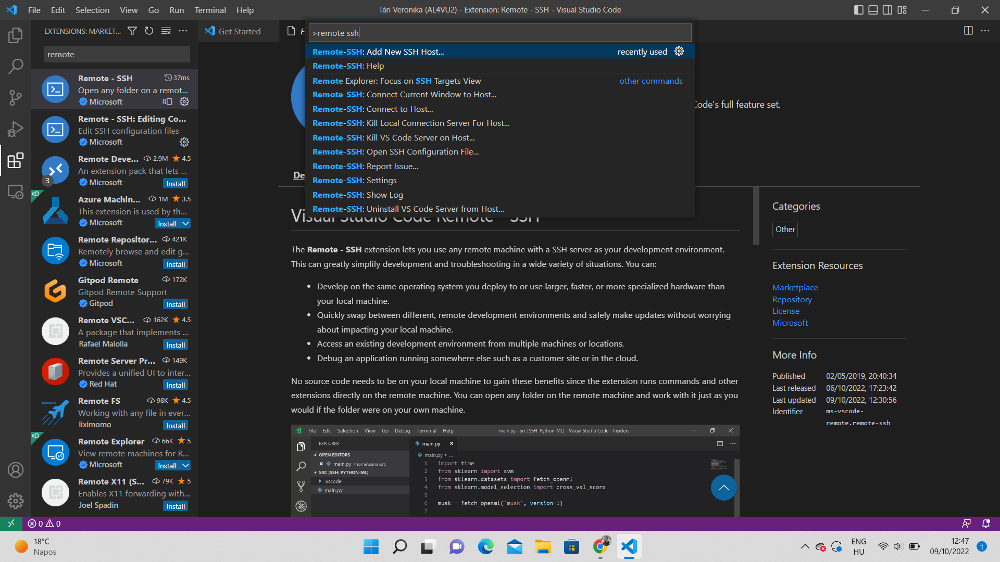
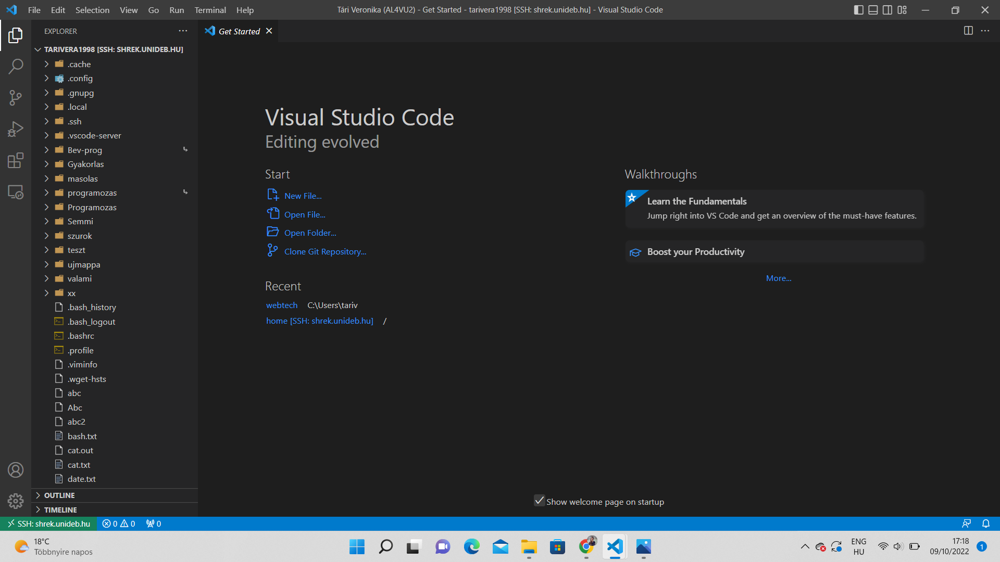
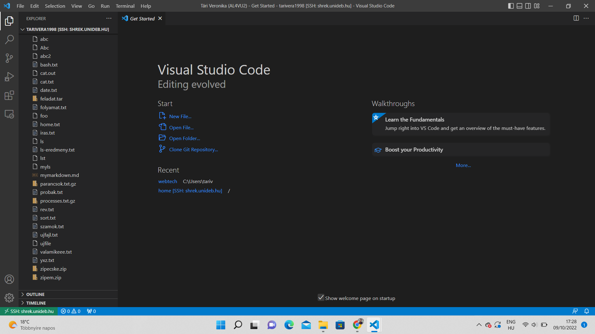

Remote-SSH Guide 💻
===================

### written by Tári Veronika (AL4VU2)
-------------------------------------

## What is **Remote-SSH**?
**Remote-SSH** is a really useful *Virtual Studio Code* extension that can enable you to reach remote servers with the help of *SSH* (you can read about this protocol here: [SSH](https://www.ssh.com/academy/ssh) ).\
The purpose of this document is to describe how to use this extension in practice. In the following I am going to list the required steps of reaching a remote server while demonstrating the process with an example.

## How to install **Remote-SSH**?
 To be able to use **Remote-SSH**, you need to install it in *Visual Studio Code* (I assume that you already have it on your laptop). First, you need to click on *Extensions* on the left handside of the screen in *VS Code* and search for **Remote-SSH**. Then you need to click on the *install* button. You can find more information about the extension on its Marketplace site: [Remote-SSH](https://marketplace.visualstudio.com/items?itemName=ms-vscode-remote.remote-ssh&ssr=false#overview).

## **Remote-SSH** commands
After successfully downloading the extension, you can reach its commands by pressing **F1** in *VSCode*.\
\

To read more about the use of **Remote-SSH** choose the *Remote-SSH help* command, which will take you to the this [website](https://code.visualstudio.com/docs/remote/ssh), where you can read about the extension in more detail.\
With **Remote-SSH** you can perform the following tasks:

1. add a new remote host
1. connect to previously added host
1. disconnect from host
1. open SSH configuration file
1. see log files
1. and several other things

## Reaching a remote host
In order to reach a new remote server you need to choose the *add new ssh host* command from the previously mentioned list. After clicking on this option you need to specify the new server you would like to reach.\
As an example I describe how you can reach the [shrek.unideb.hu](shrek.unideb.hu) server. For the connection you need execute the following command:

|ssh <network_id>@shrek.unideb.hu -p 2222 |
|-----------------------------------------|

This ssh command specifies the name of the server and the needed port as well. The network id is a unique identifier for every user. After pressing enter the server requires a password in this case. In some cases when you try to reach the server its type is not clear to the extension, so *VSCode* lets you choose from the options:
* Windows
* Linux
* macOS

Then you are connected to the server and you get a new window of *VSCode*.\
After succesfully reaching the server, you are now able to work on it. In the *Explorer* bar you can reach the remote folders and files.\
The following screenshot shows how I opened my homepage on [shrek.unideb.hu](shrek.unideb.hu) after the successful connection:\

Just as in the case of local files, you can add new files and edit the existing ones. As an example I added a new markdown document, named *mymarkdown.md*.\

## Summary of steps

The following task list summarizies the steps you need to follow in order to reach a remote server via **Remote-SSH** and create a new file.

* [ ] install the Remote-SSH extension in VSCode
* [ ] press *F1* and select *remote ssh: add new ssh port*
* [ ] in the ssh command specify the server you want to use
* [ ] choose server type if asked
* [ ] getting a new *VSCode* window
* [ ] in the *Explorer* menu: select the folder you want to reach
* [ ] create and change files as previosly on local surfaces

## Conclusion
As it is clear from the aforementioned steps, **Remote-SSH** is an easy-to-use userfriendly *VSCode* extension if you would like to reach a remote host from your computer. This extension also has other options and advanced settings as well. To read about these I recommend [this website](https://code.visualstudio.com/docs/remote/ssh).

